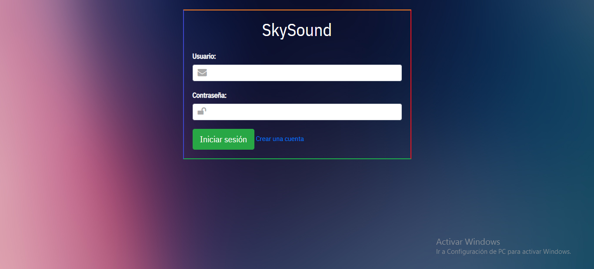
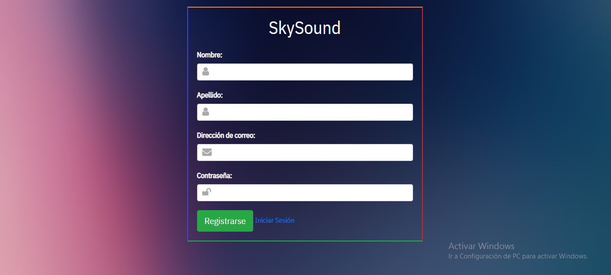
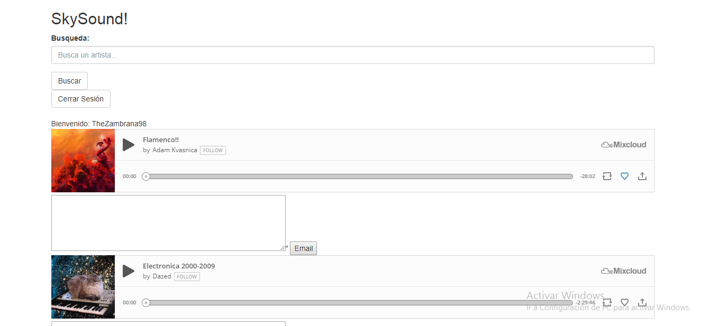
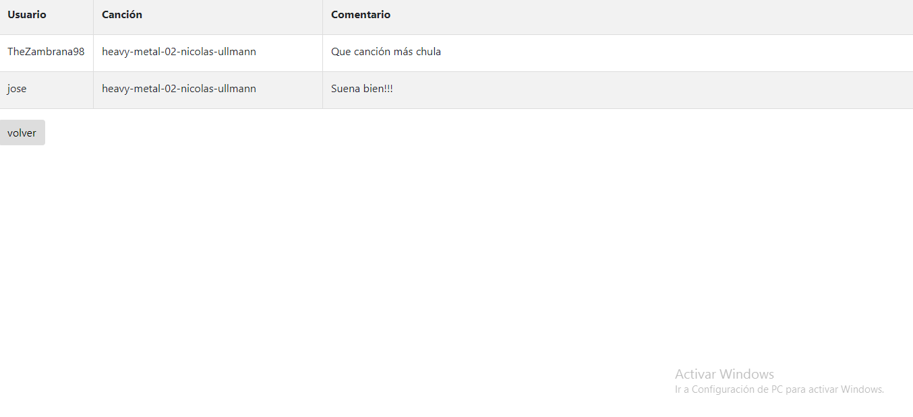
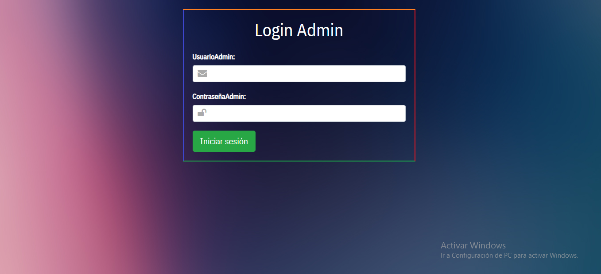
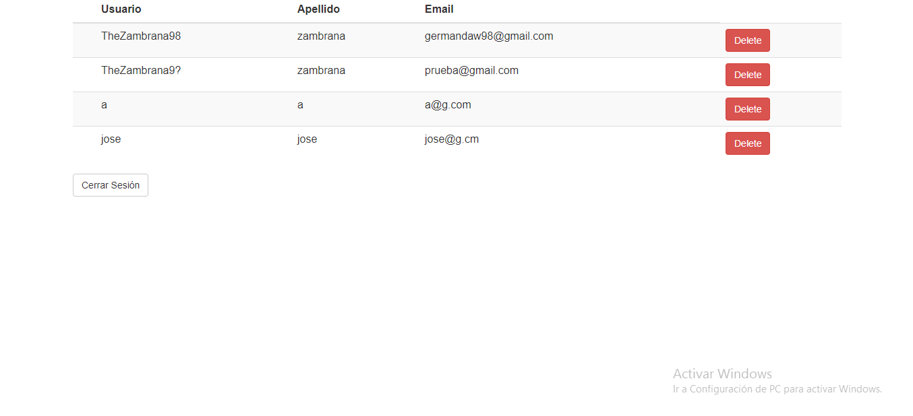

# SkySound

SkySound es una página en la que puedes buscar música, reproducirla y comentar.
Cuenta con un login, un registro y un apartado de administrador

Instrucciones de uso: En el buscador de inicio puedes buscar por letra "a" para ver todos los resultados que hay y poder experimentar.
Si quieres iniciar el modo admin, entra en el link "http://skysoundmusic.epizy.com/PROYECTO/admin/loginadmin.php" donde la contraseña y el usuario son "TheZambrana98".

Inicio de sesión de Usuario 

Registro de Usuario

Menú de inicio

Apartado de comentarios

Login de administrador

Menú de administrador para controlar usuarios

